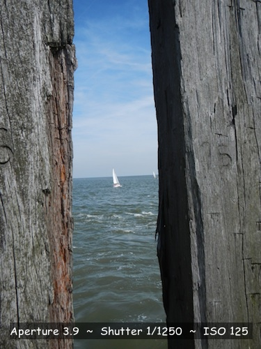
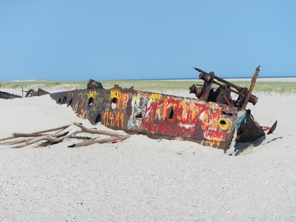
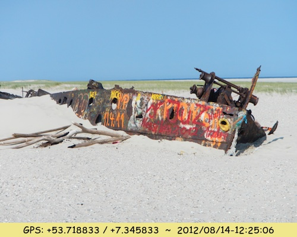

# Annotate a Picture with Exif Data

## Overview
An up to date digicam saves a lot off additional data (Exif, Exchangeable Image File Format) combined with the picture. E.g. values for aperture, shutter speed, camera model and much more. Has the camera a GPS module you also have embedded data for the GPS coords, the altitude and the exact GPS timestamp.

 ... 

## Utility
The utility exif2picture.pl allows it to annotate one or more pictures with its embedded Exif data and/or further text. The utility doesn't changes the source picture in any way, it creates a new destination picture (e.g. Sailor.jpg -> anno_Sailor.jpg) instead.

**exif2picture.pl** is a wrapper around the first class tools **ExifTool** and **ImageMagick** and runs under Linux, OS X and Windows. The utility is especially appropriate if you intend to annotate a lot pictures with a specific labeling scheme.

 ... 

## Requirements
- <a href="http://owl.phy.queensu.ca/~phil/exiftool/">ExifTool</a> installed
- <a href="http://www.imagemagick.org/script/index.php">ImageMagick</a> installed
- Perl installed

 ... 

## Usage
1. list the embedded exif data for a sample picture (e.g. perl exif2picture.pl -listexif Sailor.jpg)
2. copy and paste one or more exif tags to the config file (e.g. " Aperture {Aperture} ~ Shutter {Shutter Speed} ~ ISO {ISO} ")
3. adjust the configuration setting (e.g. colors, font, pointsize, gravity)
4. process your picture(s) (e.g. perl exif2picture.pl Sailor.jpg)

```
exif2picture.pl - Exif to Picture, 0.3 - 2017/09/21

Copyright (C) 2012-2017 Klaus Tockloth <freizeitkarte@googlemail.com>
This program comes with ABSOLUTELY NO WARRANTY. This is free software,
and you are welcome to redistribute it under certain conditions.

Usage:
perl exif2picture.pl [-listexif] [-rawdata] [-cfgfile="filename"] [-fileprefix="string"] picture1 ... pictureN

Examples:
perl exif2picture.pl DSCN0200.jpg
perl exif2picture.pl *.jpg
perl exif2picture.pl -listexif DSCN0200.jpg
perl exif2picture.pl -cfgfile="label-below.cfg" DSCN0200.jpg
perl exif2picture.pl -fileprefix="annotated_" *.jpg

Options:
-listexif   = list the readable exif data to stdout
-rawdata    = raw exif data without any interpretation or formatting
-cfgfile    = configuration file (default: exif2picture.cfg)
            = label-above.cfg, label-ontop.cfg, label-below.cfg
-fileprefix = prefix for destination filenames (default: anno_)

Arguments:
pictures    = list of pictures to process (wildcards valid)

Purpose:
This utility allows it to annotate one or more pictures
with its embedded exif data and or further text.

How to use:
1. list the embedded exif data for a sample picture
2. copy and paste one or more exif tags to the config file
3. process your pictures
```